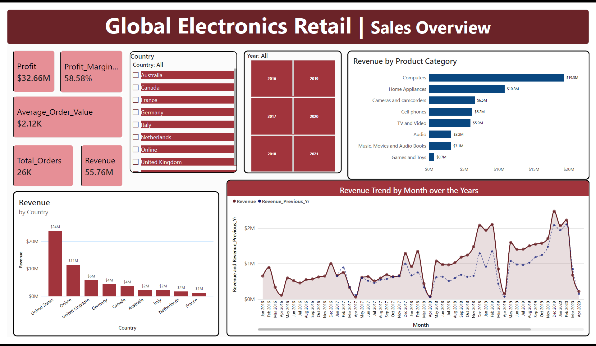
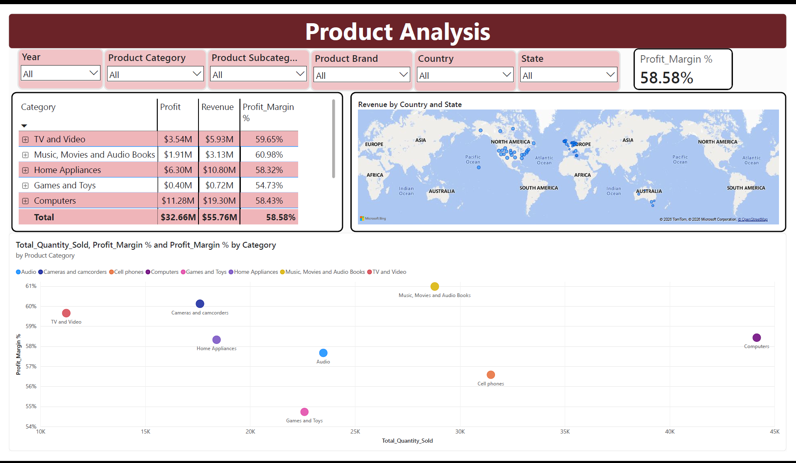
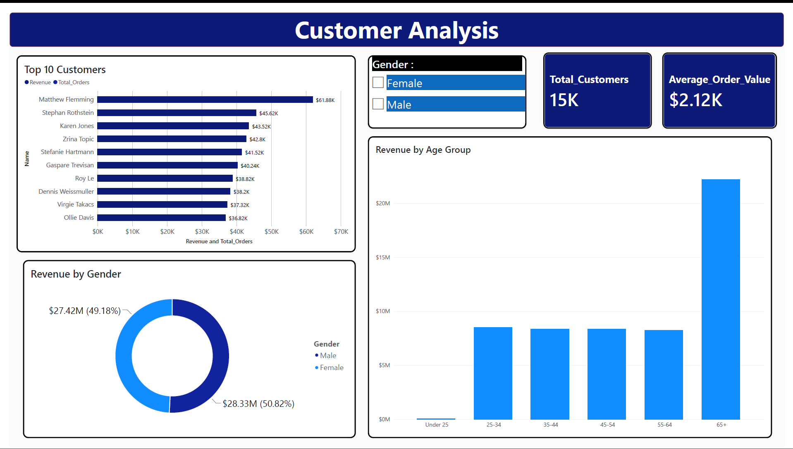

# Global Electronics Retailer — Power BI Dashboard

## Overview
An end-to-end Power BI project analyzing sales, profitability, product performance, and customer behavior for a fictitious global electronics retailer, built as a data analyst portfolio project.

## Dataset
[Global Electronics Retailer — Maven Analytics Data Playground](https://mavenanalytics.io/data-playground/global-electronics-retailer)
5 relational tables: Sales, Products, Customers, Stores, Exchange Rates (2016-2021, 8 countries)

## Business Questions
- Which product categories and countries drive the most revenue and profit?
- How has revenue trended over time, and how does it compare year-over-year?
- Which products are high-volume vs. high-margin?
- Who are the top customers, and how does revenue break down by gender and age?
- How do sales differ by country, store, and region?

## Approach
- **Power Query**: Imported and cleaned 5 source tables — fixed data types, resolved locale-based date parsing errors, handled nulls (e.g. Delivery Date, left as-is where blank was a valid business state), removed currency symbols blocking numeric conversion
- **Data Modeling**: Built a star schema — Sales as the fact table, with Products, Customers, Stores as dimension tables, plus a standalone Date table for time intelligence
- **DAX**: Revenue, Profit, Profit Margin %, Average Order Value, Total Orders, Total Customers, YoY growth (SAMEPERIODLASTYEAR), Age Group bucketing

## Key Insights
- Total Revenue: $55.76M | Profit: $32.66M | Profit Margin: 58.58%
- Computers is the top-performing category at $19.3M revenue, nearly double the next closest category (Home Appliances, $10.8M)
- United States leads by a wide margin at $24M revenue, followed by Online sales at $11M
- Clear seasonal revenue spikes each December, with a visible dip in early-to-mid 2020
- Revenue splits nearly evenly by gender (50.82% male / 49.18% female)

## Dashboard Pages
1. **Sales Overview** — KPIs, revenue trend with YoY comparison, revenue by category and country
2. **Product Analysis** — category/subcategory drill-down table, quantity vs. margin scatter plot, geographic sales distribution
3. **Customer Analysis** — top 10 customers, revenue by gender and age group

## Tools Used
Power BI Desktop, Power Query (M), DAX

## Note
Built as a personal learning/portfolio project; not affiliated with a real retailer.
